# 利用OCR识别验证码, 解决一次实际问题 (Node.js)

## 用户故事 (User Story)

最近因为牙齿不舒服, 打算通过网上预约挂号, 到附近医院的口腔科就诊. 打开网页注册帐号, 来到预约页面, 预约流程如下:

1. 确定医生和时间段, 点击"预约" (图1)
2. 来到确认预约页面, 输入验证码, 点击"确认预约挂号信息" (图2)
3. 大概1~2秒后, 提示预约失败 (图3), 否则预约成功 (没成功过, 否则就不会有这篇文章了)

图1 - 预约列表

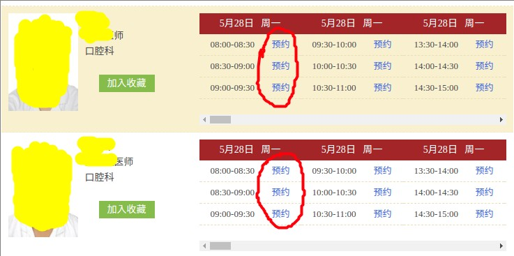

图2 - 确认预约

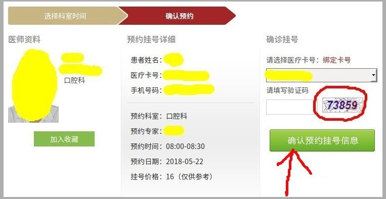

图3 - 预约失败弹窗

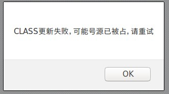

我尝试预约大概几十次, 全部不成功. 那么问题来了, 既然被预约掉了, 为什么"预约"还是可点击状态? 如果有1000个预约时间段, 且全被占用, 每个预约过程用时5秒钟, 意味着用户需要花费1小时以上, 至少2000次鼠标点击和5000次键盘输入(验证码), 才能知道自己预约不上... 天~~ 这体验确定是给人用的? 为什么不做个简单的状态区分, 比如隐藏"预约"或者变为灰色等等. 这里给UX打一个巨大的差评!!!

吐槽完了回来, 简单想了一会儿, 反复尝试的过程何不用程序来完成? **简单重复的工作**恰恰是机器最擅长的! 而且"懒"也是推动软件业发展的最大动力啊~

## 分析问题 (Brain Storm)

分析包括以下几个方面:

* 登录授权. 登录后服务器返回的Session Cookie, 大概长这个样子: `ASP.NET_SessionId=xxx; User=yyy; PWD=zzz`. 拿到Postman里做了简单测试, 服务器没有做IP/UA/Referer等检查, 所以请求里只要带上Cookie就被认为是合法了
* 所有预约的时间段. 服务器在后端做好了渲染, 需要从HTML里解析出想要的数据. 提取出来的预约链接为`/Reservationinfo?PeriodId=111&MZSJ=2018-05-22&YSDM=32...`, 链接里还包含部分数据
* 验证码识别. 整个程序最大的难点, 获取验证码图片是单独的API`/GetNewVerifyCode`, 这里遇到的验证码如图5, 有一些噪点和颜色变换, 但庆幸是 **纯数字** 没有其他符号, 而且没有干扰线, 文字没有粘连和扭曲, 所以通过对图片进行降噪处理, 得到图6结果, 已经非常非常容易辨认了. 识别引擎识别效果不错, 不经训练已经达到74%成功率, **训练一次后识别率达到89%**, 实际使用中几乎感觉不到识别失败. (12306那种就放弃吧)
* 提交预约. 最关键一步, 提交预约是一个POST请求, 数据格式为JSON, 所有数据都得到了, 包括最复杂的验证码部分. 请求的API为`/CommitReservation`
* 预约结果. 预约失败或者验证码错误, 都是返回一段Javascript脚本`<script>alert("验证码错误");history.go(-1)</script>`, alert的内容可以用来判断预约结果.

图4 - 验证码原图


图5 - 处理后的验证码图片

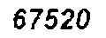

> 这里用到Chrome开发者工具, 通过Network/元素查看等等分析得到上述内容, 都是时间和耐心的问题, 过程就不详述了. 验证码识别细节在下一部分.

## 解决方案 (Solution)

问题基本清楚了, 程序的流程大概是一个循环过程, 直到预约成功, 或者全部预约失败... 一图胜千言:

图6 - 程序流程

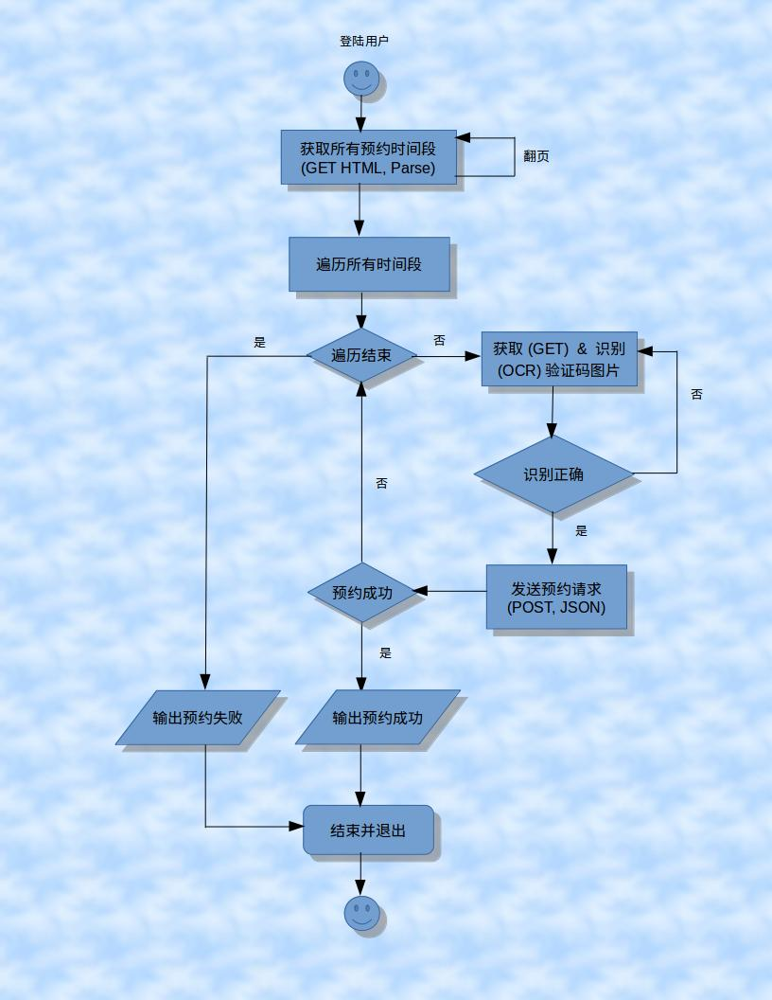

总体看下来, HTTP请求和HTML处理问题不大, 无论何种语言都有成熟的库, 这里也就不详述了.

主要是验证码, 分为图像处理和图像识别:
* 图像处理. 这里主要是二值化或者叫灰阶化(只留黑白两色), 反复测试后阀值定在40%, 然后去掉四周的杂点, 最后做了放大处理. (有需要还可以做图像的分割、变换等进一步提高图像质量, 对识别成功非常有帮助)
* 图像识别. 识别前需要对样本进行训练, 得到训练数据集, 最后放到OCR引擎中用来识别, 识别出的结果后提交预约请求, 如果服务器返回"验证码错误"则重新识别.

> 这里登录Cookie手动获取, 因为登录只需一次

## 技术选型 (Tech Selection)

开发环境
* [Ubuntu Mate 1.12.1](http://ubuntu-mate.org/)
* [Node 9.2.0](https://nodejs.org)
* [JRE 1.8.0](http://www.oracle.com/technetwork/java/javase/downloads/jre8-downloads-2133155.html)

NPM包
* [request 2.86.0](https://www.npmjs.com/package/request), 发送HTTP请求
* [cheerio](https://www.npmjs.com/package/cheerio), HTML解析
* [tesseractocr 1.1.0](https://www.npmjs.com/package/tesseractocr), 文字识别
* [gm 1.23.1](https://www.npmjs.com/package/gm), 图像处理

第三方库, __*也是真正干活的库*__
* [Tesseract 3.04.01](https://github.com/tesseract-ocr/tesseract), [官方网站](https://code.google.com/p/tesseract-ocr/), 文字识别引擎
* [ImageMagicK 6.8.9-9 Q16](https://github.com/ImageMagick/ImageMagick), [官方网站](http://www.imagemagick.org), 图像处理工具
* [jTextBoxEditor][TessBoxEditor]. Tesseract配套的训练工具, 矫正识别结果 (JavaGUI程序, 需要JRE)

工具介绍
* [Tesseract][Tesseract]曾经是一款商业OCR引擎（Optical Character Recognition, 光学字符识别）, 在1985年至1994年间由惠普开发和维护. 在1995年被UNLV评为TOP3的识别引擎之一. 2005年惠普公司将其开源, 于2006交给Google继续开发和维护, 项目由Ray Smith负责, 主页在Google Code, 它可以识别100多种语言, [这里下载语言库](https://github.com/tesseract-ocr/tessdata), 可以输出普通文本/HTML/PDF等等.
* [ImageMagick](ImageMagick) (TM) 是一个免费开源的创建、编辑、合成图片的软件, 支持至少90种图片格式, 提供了非常强大的命令行接口. 它遵循GPL许可协议.

> - 上述两个工具都有Windows版本, 安装过程自己Google, 这里只介绍Linux版本安装.
> - 两者都是C++编写并且提供了CLI, 所以Node.js对它们做了一层包装(child_process), 向上层提供了Javascript语言的接口. API参见它们的npm主页
> - 其中ImageMagick有一个分支[Graphicmagic](http://www.graphicsmagick.org)，功能和命令基本一致，所以安装这个也可以.

## 编程实现 (Implementation)

> 这里涉及的所有URL地址, 都换成了假的地址, 主要是防止读者真的尝试, 把医院服务器冲垮了

### 环境准备
```bash
// Node.js和JRE安装略~

// 安装两个工具 (也可以通过下载包安装)
sudo apt install tesseract-ocr
sudo apt install imagemagick

// 测试一下是否安装成功
tesseract -v
convert --version

// 初始化一个node项目
mkdir reservation
npm init

// 安装node模块
npm i -D request tesseractocr gm cheerio

// 安装jTessBoxEditor
// 解压后进入目录, 执行如下命令, 可以看到一个Swing GUI界面
java -jar jTessBoxEditor.jar
```

完成后准备目录结构如图:

图7 - 工作目录

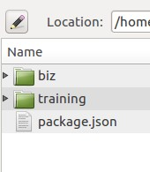

### Tesseract训练
1. 准备100张验证码图片 (通过之前提到的`/GetNewVerifyCode`接口下载)
2. 对图片进行降噪处理, 并保存 (这里要转为tif/tiff格式, 否则会失败)
3. Merge所有样本图片, 生成Box文件
4. 用jTessBoxEditor矫正识别结果, 保存Box文件
5. Tesseract训练, 最后生成训练数据集
6. 将训练集放到Tesseract的tessdata目录, 识别验证码用到

下面来一步步来进行训练的过程

#### 下载和转换图片

代码1 - 下载和转换图片

> 文件在 _/biz/download_images.js_

```js
"use strict";

const request = require("request");
const fs = require("fs");
const gm = require("gm").subClass({ imageMagick: true });
const path = require("path");

const URL_VERIFY_CODE = "http://xyz.hospital.com/GetNewVerifyCode";
const FOLDER_SRC_IMAGE = "../training/src_images";
const FOLDER_GRAY_IMAGE = "../training/gray_images";
let counter = 100;

// 建立文件夹
createFolders();
// 批量下载, 如果下载完成, 会批量处理图片
batchDownload();

// 批量下载100张图片
function batchDownload() {
    let url = URL_VERIFY_CODE + "?" + Date.now();

    request({
        method: "GET",
        url: url,
        encoding: null  // 必须设置null, 否则会被当作字符处理
    }, function(err, resp, body) {
        let name = (Math.random() + "").slice(2);
        fs.writeFileSync(path.resolve(FOLDER_SRC_IMAGE, name + ".jpg"), body);

        console.log(name + ".jpg is downloaded.");
        counter -= 1;

        // 随机延迟0.5到1秒, 再进行下一次下载
        if (counter !== 0) {
            let delay = Math.round(Math.random() * 500 + 500);

            console.log("Will delay " + delay + "ms");
            setTimeout(batchDownload, delay);
        } else {
            // 下载完成, 处理图像
            batchConvert();
        }
    });
}

// 批量对图片进行降噪和格式转换
function batchConvert() {
    let images = fs.readdirSync(FOLDER_SRC_IMAGE);

    for (let image of images) {
        let imgName = image.slice(0, image.lastIndexOf("."));
        let srcImage = path.resolve(FOLDER_SRC_IMAGE, image);
        let grayImage = path.resolve(FOLDER_GRAY_IMAGE, imgName + ".tif");

        gm(srcImage)
            .resize(120, 44)
            .colorspace("gray")
            .normalize()
            .threshold("40%")
            .crop(88, 24, 14, 10)
            .extent(120, 44, "-14-10")
            .stream("TIF", function(err, stdout, stderr) {
                let wStream = fs.createWriteStream(grayImage);
                stdout.pipe(wStream);

                console.log(grayImage + " is converted");
            });
    }
}

function createFolders() {
    if (!fs.existsSync(FOLDER_SRC_IMAGE)) {
        fs.mkdirSync(FOLDER_SRC_IMAGE);
    }

    if (!fs.existsSync(FOLDER_GRAY_IMAGE)) {
        fs.mkdirSync(FOLDER_GRAY_IMAGE);
    }
}
```

运行代码

```bash
node download_images.js
```

#### Merge图片, 并生成Box文件

运行完成后在 _training_ 目录下得到 _src_images_ 和 _gray_images_ 两个目录, 其中 _gray_images_ 目录里有处理好的图片, 随后用到:

1. 执行`java -jar jTessBoxEditor.jar`运行[jTessBoxEditor GUI][TessBoxEditor]界面
2. 点击菜单 **Tools** -> **Merge TIFF**
3. 选择 _gram_images_ 目录下所有图片, 点击 **open** (图片8)
4. 弹出保存窗口, 保存文件名为 _num.font.exp0.tif_, 点击 **save** (图片9)

图片8 - Merge所有tif图片文件

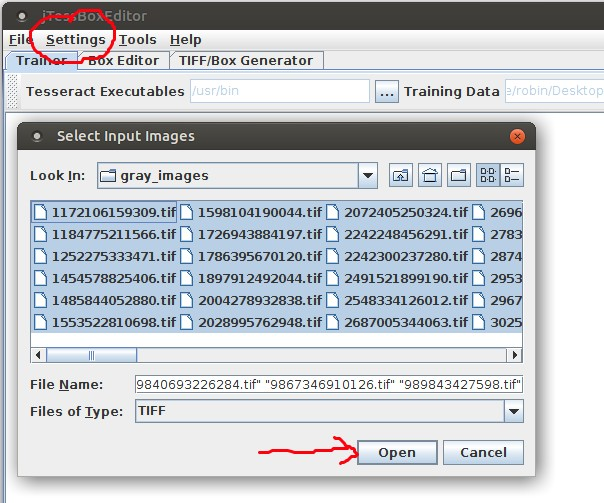

图9 - 保存合并后的文件

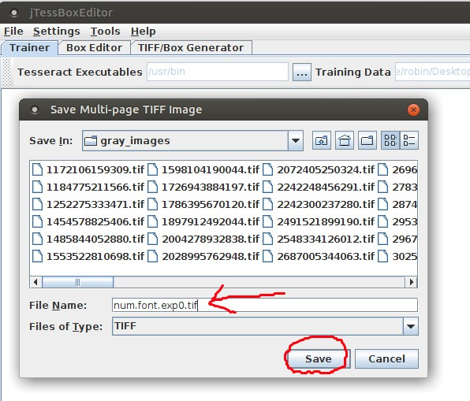

现在得到新文件 _num.font.exp0.tif_, 用它生成Box文件, 就是用它来矫正和训练结果集. 执行如下命令:

```bash
tesseract num.font.exp0.tif num.font.exp0 batch.nochop makebox
```

> 语法规则: tesseract [language].[fontname].exp[num].tif [language].[fontname].exp[num] batch.nochop makebox
> 
> language为语言名称, fontname为字体名称, num为序号; **在tesseractv中, 一定要注意格式**

现在会生成一个文件 _num.font.exp0.box_ 文件. 如图10

图10 - merge文件和box文件

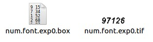

#### 训练图片 (矫正识别结果, 并保存)

依然是在jTessBoxEdit中, 切换到 **Box Editor** 选项卡, 点击 **Open** , 打开刚才的合并文件 _num.font.exp0.tif_ (__保证同目录下有box文件__)

图11 - 矫正训练结果

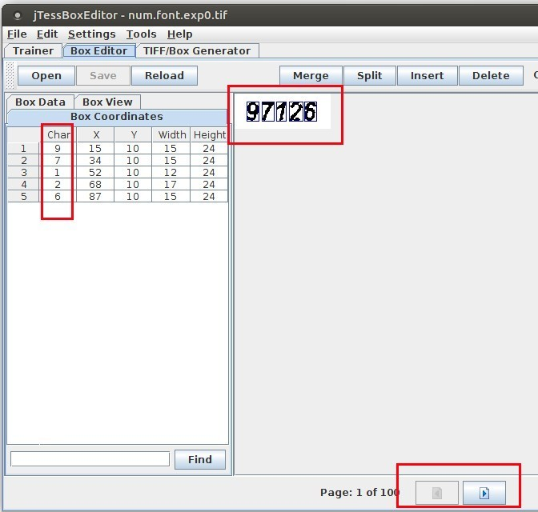

如图10, 就在左面 **Box Coordinates** 中矫正识别结果, 可以修改识别后的字符, 以及每个字符的X和Y位置以及宽高, 记得我们100张图片, 所以记得翻页处理哦! 矫正完成后点击 **Save** 保存.

#### 根据矫正后Box文件, 生成用于识别的训练数据集

执行如下命令
> 已下用到命令, 随Tesseract一起被安装了

```bash
echo 训练Tesseract, Run Tesseract for Training..
tesseract num.font.exp0.tif num.font.exp0 nobatch box.train

echo 计算字符集, Compute the Character Set..
unicharset_extractor num.font.exp0.box
mftraining -F font_properties -U unicharset -O num.unicharset num.font.exp0.tr

echo 聚集, Clustering..
cntraining num.font.exp0.tr

echo 重命名文件, Rename Files..
rename normproto num.normproto
rename inttemp num.inttemp
rename pffmtable num.pffmtable
rename shapetable num.shapetable

echo 创建Tessdata, Create Tessdata..
combine_tessdata.exe num.
```

#### 将训练集放到Tesseract的tessdata目录

执行完成上面的命令后, 得到一个文件 _num.traindata_, 找到你的 _Tesseract-OCR/tessdata_ 目录, 将 _num.traindata_ 复制进去.

```bash
mv num.traindata /usr/share/tesseract-ocr/tessdata
```

至此训练就完成了, 下面测试一下识别效果:

```bash
tesseract test.png output.file -l num
```

图12 - 识别结果

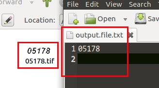

一次成功, 识别结果还不错! 整个过程比较繁琐, 如果有不对的地方, 仔细检查每个步骤~ 下面就是用代码把整个流程串联起来, 让预约流程自动化

### 获取所有预约数据

> `...`代表省略部分代码, 建议将Node.js升级到9.0以上版本, 可以直接使用`async/await`而无需babel转换

代码2 - 获取所有预约信息

> 文件 _/biz/business.js_ 和 _/biz/util.js_ (工具类)

```js
/*
 * biz/business.js 文件
 */

"use strict";

const fs = require("fs");
const { URL } = require("url");
const cheerio = require("cheerio");
const asyncRequest = require("async-http-request");
const util = require("./util"); // 一个工具模块
const recognizeImage = require("./ocr-image");

// 省略部分变量定义...

// 收集所有预约信息
async function collectReservations() {
    let docUrls = URL_DOC_LIST;
    let reservations = [];

    for (let url of docUrls) {
        let ua = util.getRandomUA();
        let html = await asyncRequest.get({url, headers: {
            "User-Agent": ua
        }});
        let $ = cheerio.load(html);

        $("div[class*=ys_list]").each((i, el) => {
            let $el = $(el);

            let docName = $el.find(".ys_js dt .f_b").text();
            let paths = [];
            $el.find(".yysj dt .f_float a").each((j, a) => {
                paths.push($(a).attr("href"));
            });
            reservations.push({
                docName, paths
            });
        });
    }
    return reservations;
}

// 遍历所有预约数据, 并提交预约数据
async function submitReservations(reservations = []) {
    let _formData = FORM_DATE_TEMPLATE;

    for (let reservation of reservations) {
        let { docName, paths } = reservation;

        for (let path of paths) {
            let url = new URL(URL_BASE + path);
            let oSearchParam = url.searchParams;
            let verifyCode = VERIFY_CODE[VERIFY_CODE.length - 1];
            // ...

            // 注意验证码和一些随机信息
            let params = {
                PeriodId: oSearchParam.get("PeriodId"),
                // ...
                yzm: verifyCode,
                // ...
                "button.x": Math.floor(Math.random() * 209),
                "button.y": Math.floor(Math.random() * 45)
            };

            let formData = Object.assign({}, _formData, params);
            let body = await util.sendReserveRequest(formData, url.toString());

            if (body.includes(RESP_USED)) {
                util.log(`[${docName}] has NO TIME at [${params.RegDate} ${params.Time}]`);
                await new Promise(resolve => setTimeout(resolve, Math.random() * 800));
            } else if (body.includes(RESP_CODE_INVALID)) {
                // ...
            } else {
                util.log(`Congrats!!! ...`);
                process.exit();
            }
        }
    }
    util.log(`... You can't reserve any doctors, ...try another hospital`);
}

// 刷新并识别新的验证码
async function refreshVerifyCode() {
    let oRequest = await util.execRequest({
        url: URL_GET_VERIFY_CODE,
        resolveWithRequest: true
    });

    if (!fs.statSync(TEMP_FOLDER).isDirectory()) {
        fs.mkdirSync(TEMP_FOLDER);
    }
    return recognizeImage(oRequest);
}

module.exports = {
    collectReservations,
    submitReservations,
    refreshVerifyCode
}
```

代码3 - 封装一些工具方法

```js
/*
 * biz/util.js 文件
 */

"use strict";

const asyncRequest = require("async-http-request");
const USER_AGENTS = [
    "Mozilla/5.0 (Windows NT 6.1; rv:2.0.1) Gecko/20100101 Firefox/4.0.1",
    // ...
];
// ...

// 日志打印
function log(msg) {
    // ...
}

// 随机获取一个UA
function getRandomUA() {
    let len = USER_AGENTS.length;
    return USER_AGENTS[Math.floor(Math.random() * 5)];
}

// 发送一个请求, 这里会携带Cookie
async function execRequest(options, referer) {
    let jar = await asyncRequest.jar();
    let cookie = await asyncRequest.cookie(COOKIE);
    jar.setCookie(cookie, BASE_URL);

    let userAgent = getRandomUA();
    let defaultOpts = {
        method: "GET",
        jar: jar,
        // ...
    };
    return await asyncRequest(Object.assign(defaultOpts, options));
}

// 发送预约请求, POST+Form data
async function sendReserveRequest(formData, referer) {
    return execRequest({
        method: "POST",
        url: RESERVER_URL,
        form: formData
    }, referer);
}

module.exports = {
    log,
    getRandomUA,
    execRequest,
    sendReserveRequest
}
```

### 识别验证码并提交预约

代码4 - 图像识别

> 文件 _/biz/ocr_image.js_ 和 _/main.js_ 文件

```js
/*
 * biz/ocr_image.js 文件
 */

"use strict";

const path = require("path");
const fs = require("fs");
const gm = require("gm").subClass({ imageMagick: true });
const tessorc = require("tesseractocr");
// ...

// 识别验证码, 并保存起来 (用来进一步训练)
async function recognizeImage(oRequest) {
    let recognize = tessorc.withOptions({
        language: "num2"
    });
    let fileName = `${TEMP_FOLDER}/${Date.now()}.tif`;

    return new Promise((resolve, reject) => {
        gm(oRequest)
        .resize(120, 44)
        .colorspace("gray")
        .normalize()
        .threshold("40%")
        .crop(88, 24, 14, 10)
        .extent(120, 44, "-14-10")
        .write(fileName, err => {
            if (err) {
                reject(err);
            }
            recognize(fileName, (err, text) => {
                // 做一些认为修正, 如将字母o/O替换为数字0
                text = text.replace(/o|O/g, "0").replace(/i|I/g, "1").replace(/z|Z/g, "2").replace(/\s/g, "").replace(/[a-z]/gi, "");
                resolve(text);

                let target = path.resolve(TEMP_FOLDER, text + ".tif");
                fs.createReadStream(fileName).pipe(fs.createWriteStream(target));
            });
        });
    });
}

module.exports = recognizeImage;
```

代码5 - 程序入口文件

```js
/*
 * main.js 文件
 */

"use strict";

global.CONFIG = require("./bk - DONT_COMMIT/config.json");

const biz = require("./biz/business");
const util = require("./biz/util");

// Start the program
startReservation();

async function startReservation() {
    const Config = global.CONFIG;

    let verifyCodes = Config.verify_codes;
    if (!verifyCodes.length) {
        // Image recognition is in here
        let code = await biz.refreshVerifyCode();
        verifyCodes.push(code);

        util.log(`Verify code is ${code}`);
    }

    let total = 0;
    let reservations = await biz.collectReservations();
    reservations.forEach(r => total += r.paths.length);

    util.log(`Reservations are collected, total is ${total}`);

    biz.submitReservations(reservations);
}
```

## 验收测试 (Testing)

启动整个程序, 之后就可以干其他事情了~ 直到程序结束
```bash
node main
```

图13 - 运行中

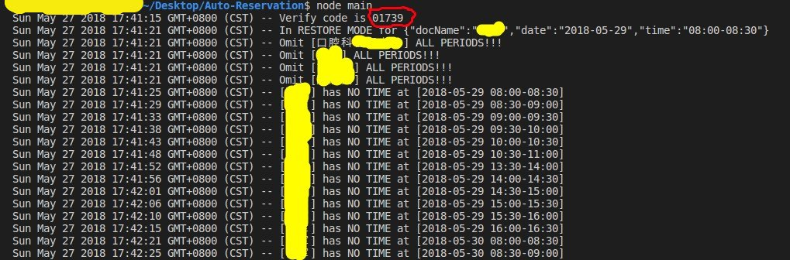

## 总结 (Summary)

解决了生活中的实际问题, 比较有意思, 而且实际体验了一把OCR识别, 当然用的还很浅. 在Tesseract官网看到已经发布4.0版本了, 而且加入了LSTM(长短期记忆网络)算法, 结合官方的一些最佳实践[改善输出质量](https://github.com/tesseract-ocr/tesseract/wiki/ImproveQuality), 可以进一步提高识别准确率, 之后还需进一步深入学习.

遗憾的是最终并没有预约成功, 并非程序问题, 而是因为网上只开放半个月内预约, 而且已经被预约一空. 幸运的是电话预约没有限制, 最终还是通过电话预约成功... ...

## 参考资料

<https://www.npmjs.com/package/request>

<https://www.npmjs.com/package/gm>

<https://www.cnblogs.com/cnlian/p/5765871.html>

<https://blog.csdn.net/zhangxb35/article/details/49592071>

[Tesseract]: https://www.npmjs.com/package/gm
[ImageMagick]: http://www.imagemagick.org
[TessBoxEditor]: http://www.softpedia.com/get/Multimedia/Graphic/Graphic-Others/jTessBoxEditor.shtml


